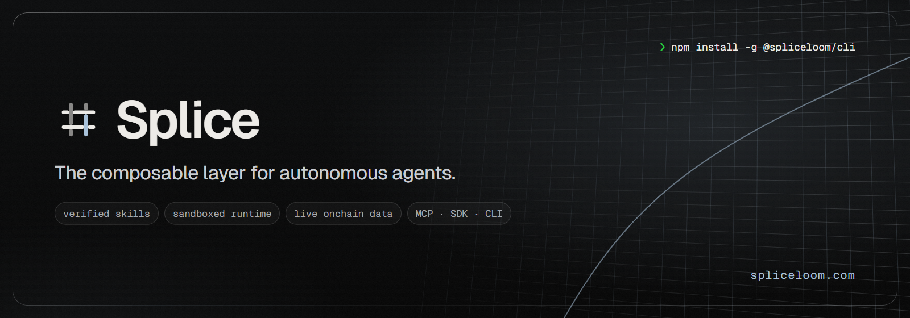
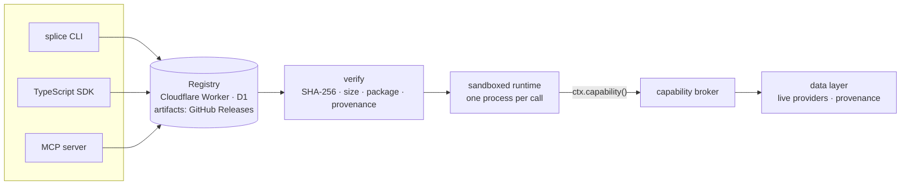

<p align="center">
  <a href="https://spliceloom.com"></a>
</p>

<p align="center">
  <a href="https://www.npmjs.com/package/@spliceloom/cli"></a>
  <a href="https://github.com/spliceloom/spliceloom/actions/workflows/ci.yml"></a>
  
  
  
  <a href="LICENSE"></a>
</p>

<p align="center">
  <a href="https://spliceloom.com"><b>Website</b></a> ·
  <a href="https://docs.spliceloom.com"><b>Docs</b></a> ·
  <a href="https://docs.spliceloom.com/quickstart"><b>Quickstart</b></a> ·
  <a href="https://docs.spliceloom.com/skills"><b>Skills</b></a> ·
  <a href="https://www.npmjs.com/package/@spliceloom/cli"><b>npm</b></a> ·
  <a href="https://x.com/spliceloom"><b>X</b></a> ·
  <a href="CHANGELOG.md"><b>Changelog</b></a>
</p>

---

**Splice** gives autonomous agents real capabilities — tools, data and services — through a
verified, permissioned package layer. A capability is a **skill**: a versioned package of tools with
typed inputs and outputs and declared permissions. Splice finds it, verifies it, installs it and runs
it in a sandbox, from the command line, from TypeScript or from any MCP client.

```
search  →  verify  →  install  →  run  →  compose
```

- **Verified before install.** SHA-256 and size against registry metadata, safe archive decoding,
  package validation and provenance. Published versions are immutable.
- **Sandboxed execution.** Every tool call runs in its own Node.js process, limited to the files,
  hosts, variables and host capabilities the package declares. Undeclared access is denied.
- **Real data, never invented.** A host data layer reads live providers — Robinhood Chain, DEX
  markets, Robinhood Stock Tokens, perps, DeFi, oracle prices, global and US markets — and labels
  every value `LIVE`, `CACHED`, `UNAVAILABLE` or `ERROR` with its source.
- **One contract everywhere.** The same tool descriptors drive the CLI, the SDK, the MCP servers and
  the registry.
- **Zero runtime dependencies.** Node.js only.

## Install

```sh
npm install -g @spliceloom/cli      # the `splice` command · Node.js 22.18+
splice chain info                   # Robinhood Chain, read live with no key
splice setup --init                 # optional: ~/.splice/.env for provider keys
```

Windows, keys and every feature: **[Quickstart](https://docs.spliceloom.com/quickstart)**.

## Live data, from the terminal

Every row below is real output: the provider, the chain and the fetch time are printed with it,
rankings print their formula, and sources are never averaged.

```console
$ splice tokens trending --limit 5
tokens trending  ● LIVE  source=codex  chain=robinhood(4663)  resource=filterTokens
  #  TOKEN    NAME           PRICE      1H      4H     24H  VOL 24H  LIQUIDITY    MCAP  HOLDERS   BUY/SELL  AGE
  1  HOOKR    Hookr.fun   $0.02577  +11.7%  +49.6%  +31.8%   $2.33M      $863K  $25.8M    7,974  2642/2448  58d
  2  ORBIO    Orbio.so    $0.08065   +1.5%   -5.7%   -5.3%   $2.45M      $970K  $76.6M   11,453  4275/3736  13d
  3  CASHCAT  Cash Cat     $0.1548   -0.5%   -6.4%   -9.6%   $3.53M      $654K   $155M  112,933  2609/2770  3mo
  4  PONS     Pons         $0.4441   -1.2%   -4.8%  -12.2%   $4.82M     $1.26M   $444M  101,657  1807/1875  24d
  5  RBD      RobinDog   $0.007357   -5.0%   -6.7%   -7.6%   $4.06M     $52.9K  $7.36M    7,997  9922/4529   8d
  ranking: Codex trending score over h24; liquidity > $10,000; tokens flagged as potential scams excluded

$ splice stock quote TSLA
stock TSLA  Tesla • Robinhood Token  0x322F0929c4625eD5bAd873c95208D54E1c003b2d
  robinhood  token $370.97 / $370.99  day $354.90–$374.60   ● LIVE  source=robinhood-stock-api
  chainlink  $370.585  (1m candle 23:03 UTC)                ● LIVE  source=chainlink-candlestick
  dex        $371.47  24h +4.4%  liquidity $336K             ● LIVE  source=dexscreener
  finnhub    $370.59  +4.7%  underlying stock                ● LIVE  source=finnhub
  codex      $370.693                                        ● LIVE  source=codex
  defillama  $370.935  confidence 0.995                      ● LIVE  source=defillama
```

| Area | Commands |
| --- | --- |
| Overview | `splice dash` |
| Tokens on Robinhood Chain | `splice tokens trending · hot · new · gainers · losers · volume · info · trades · chart · whales` |
| Research & monitoring | `splice report <token>` · `splice compare A B` · `splice radar` · `splice watch <token> --above <price>` · `splice watchlist` |
| Robinhood Stock Tokens & US markets | `splice stock list · quote · gainers · profile · news · earnings · market` · `splice oracle price · candles` |
| Perps, DeFi, macro | `splice perps` · `splice perps funding` · `splice defi protocols · yields · fees` · `splice macro` · `splice news` · `splice global` |
| Chain, wallets, contracts | `splice wallet inspect` · `splice contract inspect` · `splice tx inspect` · `splice security token` |
| Ask anything | `splice ask "…"` · `splice chat` — an agent over the read-only data tools, with sources and cost |

Many features work without keys (public RPC, DexScreener, GeckoTerminal, DefiLlama, Lighter,
CoinGecko). `splice setup` lists what each free key unlocks.

## Skills

```sh
splice init
splice search robinhood
splice info @splice/robinhood                      # versions, integrity, permissions, tools
splice add @splice/robinhood --accept-permissions  # verified before anything is extracted
splice run robinhood.trending limit=5
```

| Skill | What it does | Permissions |
| --- | --- | --- |
| [`@splice/robinhood`](skills/robinhood/SKILL.md) | Robinhood Chain tokens, research reports, large trades, stock tokens, perps, DeFi | host capabilities only |
| [`@splice/onchain`](skills/onchain/SKILL.md) | balances, transactions, blocks, tokens, contracts, logs | host capabilities only |
| [`@splice/market`](skills/market/SKILL.md) | prices, DEX pairs, candles, token security | host capabilities only |
| [`@splice/web`](skills/web/SKILL.md) | web search, page text, site maps, cited answers | host capabilities only |
| [`@splice/github`](skills/github/SKILL.md) | repositories, contents, search | `api.github.com` |
| [`@splice/http`](skills/http/SKILL.md) | HTTP GET/POST | public hosts (private addresses refused) |
| [`@splice/files`](skills/files/SKILL.md) | read, write, list | `workspace/` only |
| [`@splice/json`](skills/json/SKILL.md) | parse, stringify, pick | none |

Skills that need data ask the host for a **capability** (`tokens.rank`, `stock.quote`, …) instead of
holding keys: the host checks the grant, budget and arguments, calls its configured provider and
returns the result with provenance. [Host capabilities →](https://docs.spliceloom.com/capabilities)

## From code

```sh
npm install @spliceloom/sdk
```

```ts
import { Splice, isLive } from "@spliceloom/sdk";

const splice = new Splice({ project: "./agent" });

const trending = await splice.tokens.rank("trending", { limit: 10 });
if (isLive(trending)) console.log(trending.data, trending.provenance.source);

await splice.add("@splice/json");
const result = await splice.run("json.parse", { text: '{"hello":"world"}' });
```

[SDK reference →](https://docs.spliceloom.com/sdk)

## For agents (MCP)

```sh
claude mcp add splice -- splice mcp --project ./agent --data
```

`splice mcp` serves the installed skills over stdio (or Streamable HTTP with a bearer token); `--data`
adds 70 read-only live data tools. Works with Claude Code, Claude Desktop, Cursor and any MCP client.
[MCP guide →](https://docs.spliceloom.com/mcp)

## Architecture



| Path | Package | Purpose |
| --- | --- | --- |
| [`packages/spec`](packages/spec) | `@spliceloom/spec` | manifest, schemas, names, semver, archives, verification, API types |
| [`packages/runtime`](packages/runtime) | `@spliceloom/runtime` | sandboxed tool execution, network policy, capability IPC |
| [`packages/core`](packages/core) | `@spliceloom/core` | projects, lockfile, registry client, installer, publishing |
| [`packages/data`](packages/data) | `@spliceloom/data` | live data layer: providers, routing, caching, provenance |
| [`packages/sdk`](packages/sdk) | `@spliceloom/sdk` | SDK for applications and agents |
| [`packages/mcp`](packages/mcp) | `@spliceloom/mcp` | MCP protocol, stdio and Streamable HTTP, data tools |
| [`packages/cli`](packages/cli) | `@spliceloom/cli` | the `splice` command |
| [`apps/registry`](apps/registry) | — | registry Worker (D1 + GitHub Releases) and a local Node registry |
| [`apps/site`](apps/site) | — | spliceloom.com and docs.spliceloom.com (static, built from `docs/`) |
| [`skills`](skills) | `@splice/*` | official skills |
| [`examples`](examples) | — | an agent and a multi-skill composition |

## Security

SHA-256 verification proves **integrity** — you received the bytes the registry recorded — not
**authenticity**: packages are not signed yet. The runtime is a strong guardrail built on the Node.js
permission model and an in-process network guard, not OS-level isolation. Provider keys stay in the
host and are redacted from every result. Read the [security model](https://docs.spliceloom.com/security)
before running third-party skills, and report vulnerabilities privately as described in
[SECURITY.md](SECURITY.md).

## Development

```sh
npm install
npm test             # clean build + every unit, integration and end-to-end test
npm run typecheck    # strict, incl. skills, examples and the website
npm run test:live    # real provider integration tests (needs provider keys)
npm run site:build   # apps/site/dist (site) + apps/site/dist-docs (docs)
```

No Cloudflare account, Docker or provider key is needed for development and the test suite.
See [CONTRIBUTING.md](CONTRIBUTING.md).

## Status

Developer preview. Working today: the public registry, CLI, SDK, MCP servers, sandboxed runtime,
capability broker, live data layer and eight official skills. Not yet: package signing, organizations
and private registries, hosted skill execution. See the [roadmap](https://docs.spliceloom.com/overview).

> [!IMPORTANT]
> **Splice has not launched a token.** A contract address will only ever be announced on
> [spliceloom.com](https://spliceloom.com) and [@spliceloom on X](https://x.com/spliceloom). Any
> token that claims to be Splice before that announcement is not ours.

Splice is an independent project. It is not affiliated with, endorsed by or sponsored by Robinhood
Markets, Inc.; Robinhood Chain is referenced as a public network that Splice reads data from.
Market data is not financial advice.

## License

[MIT](LICENSE)
